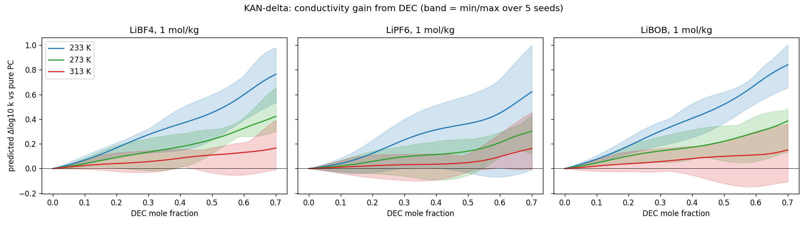

# CALiSol-23: predicting Li-electrolyte conductivity for an unseen solvent (DEC)

Hackathon entry for the Kaggle **CALiSol-23 Challenge**. The task is to predict the ionic conductivity
(log10 k, in mS/cm) of non-aqueous lithium electrolytes. The split is **leave-one-solvent-out**:
every test row contains diethyl carbonate (DEC), and no training row does.

**Result:** anchoring each prediction to measured pure-PC conductivity and learning only the
co-solvent correction with a small KAN cuts the error on the most test-like held-out fold from
0.242 (gradient boosting) to **0.142** log10 RMSE, with near-zero bias.

## The key observation

Exploratory analysis ([eda.py](eda.py)) showed that the test set is **99.4% PC+DEC binaries**
(PC:DEC weight ratios 0.9:0.1 to 0.3:0.7) with only three salts: LiBF4, LiPF6 and LiBOB.
The same research group's pure-PC, EC+PC and PC+EA series are in the training set, and they use
the same temperature grid, molality units and weight-fraction grid as the test set.

So the problem is not "learn conductivity from scratch". It is:

> Given measured pure-PC conductivity at the same salt, concentration and temperature,
> how much does replacing part of the PC with a linear carbonate change it?

## Approach

| Stage | Script | What it does |
|---|---|---|
| EDA | [eda.py](eda.py) | Data audit, train vs test coverage, figures in [figs/](figs/) |
| Baseline | [pipeline.py](pipeline.py) | HistGradientBoosting on physics descriptors: mole-fraction-weighted ε, ln η, M, ρ; 1/T and VTF terms; molality; monotone in T |
| Anchor-delta | [anchor.py](anchor.py) | Interpolates the same-source **pure-PC anchor** in concentration and 1/T (no extrapolation), then fits the difference Δ = log k(mixture) − log k(pure PC) |
| **KAN-delta** | [kan.py](kan.py) | FastKAN-style network in PyTorch (SiLU + 8 Gaussian RBFs per edge, smoothness penalty) with the hard constraint **Δ = x_co · h(features)**, so Δ = 0 when there is no co-solvent |
| Comparisons | [compare.py](compare.py), [kanfull.py](kanfull.py), [extend.py](extend.py) | GP and MLP on the same setup; KAN without the anchor; extending anchors beyond the measured range |
| **Final** | [final.py](final.py) | Reproducible rebuild of the submission (fixed seeds, about 20 s) |

KAN-delta inputs: co-solvent mole fraction; co-solvent ε, ln η and M; mixture ε and ln η; 1000/T;
molality; and a 2-dimensional learned salt embedding. **No solvent names are used anywhere**, so the
model can only generalize to DEC through its physical properties.

## Validation

A random k-fold split would leak formulations between train and validation. Instead, whole
solvent systems are held out:

- **Fold A (primary):** all PC+EA rows. PC plus a thin linear co-solvent is the closest analogue to PC+DEC.
- **Fold B:** all EC+PC rows, reported per salt.

log10 RMSE / mean bias on held-out rows that have an anchor:

| Model | Fold A | Fold A, T < 250 K | Fold B | Fold B, T < 250 K |
|---|---|---|---|---|
| Gradient boosting (Phase 2) | 0.242 / −0.152 | 0.219 / −0.163 | 0.198 / +0.086 | 0.212 / +0.061 |
| Anchor + HGB-delta | 0.175 / −0.020 | 0.192 / +0.029 | 0.195 / −0.064 | 0.328 / −0.204 |
| **Anchor + KAN-delta** | **0.142 / +0.007** | **0.077 / +0.011** | **0.140 / −0.001** | 0.219 / −0.021 |
| Anchor + MLP-delta | 0.150 / −0.065 | 0.085 / +0.008 | 0.176 / +0.061 | 0.281 / +0.136 |
| Anchor + GP-delta | 0.286 / −0.201 | 0.451 / −0.378 | 0.281 / +0.212 | 0.306 / +0.142 |
| KAN on log k, no anchor | 0.284 / −0.087 | 0.295 / −0.167 | 0.269 / +0.176 | 0.425 / +0.353 |

These are cross-validation numbers on training data, not leaderboard scores. The expected result
of each experiment was written down before it ran, and the logs (`*_output.txt`) record whether
it held.

## What the model learned



Replacing PC with DEC **raises** conductivity, and much more at low temperature (+0.6 to +0.85
log10 at 233 K versus about +0.15 at 313 K, at 1 mol/kg). At low temperature, conductivity is
limited by viscosity, and DEC (0.75 cP) is far less viscous than PC (2.53 cP). The measured PC+EA
data in train shows the same trend. The shaded bands show the spread over 5 seeds, which grows
at high DEC fraction.

## Final submission

`submission_final.csv` (`id,log_k`, clipped at log_k ≥ −2):

- **5313 rows:** pure-PC anchor + KAN-delta (5 seeds, 107 epochs).
- **646 rows:** gradient boosting, used where no anchor exists (concentration outside the measured
  pure-PC range, LiPF6 below 230 K, or no PC in the mixture).

```bash
pip install numpy pandas scikit-learn torch matplotlib
# place the Kaggle files in ./ca-li-sol-23-challenge/ (not included in this repo)
python3 pipeline.py   # Phase 2 GBM -> submission_logk.csv (needed for the fallback rows)
python3 anchor.py     # -> submission_anchor.csv
python3 final.py      # -> submission_final.csv, submission_final_plus01.csv
```

`submission_final_plus01.csv` (the same predictions + 0.1) is a diagnostic for probing a global offset.
The other `submission_*.csv` files are intermediate variants kept for reference. `submission.csv`
is in the linear `id,k` format and does not match the competition's `id,log_k` header.

## What didn't work

- **Extending anchors beyond the measured data.** Extrapolating in concentration failed its own
  hold-out test (0.28 and 0.16 RMSE). Extending to colder temperatures passed on pure PC (0.136) but
  gave −0.5 bias on the mixture rows it newly covered, so it isn't used.
- **VTF-parameterized KAN as the fallback model.** The learned T0 barely moved from its starting value
  (about 130 K for every salt), so B and T0 are not identifiable from this data.
- **Gaussian process on h = Δ/x_co.** Dividing by x_co amplifies noise, and the GP fell back to the
  average h for the unseen co-solvent region.
- **Weighting same-source rows ×3** in gradient boosting made both folds worse.

## Caveats

- Solvent properties (ε, η, ρ, M near 25 °C) are hand-entered literature values in
  [pipeline.py](pipeline.py). Values for TFP, MOEMC and FEC are the least certain.
- Almost all DEC predictions depend on a single group's PC series. If the test data came from a
  different lab or protocol, the anchor would carry that lab's systematic offset into every prediction.
- The data is not redistributed here. Get it from the Kaggle competition page.
